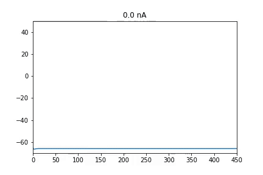

# Neuron_Model
Project for the BYU ACME program's Volume 4 class

# Bifurcation Animation

# Files
1) hhdemo.ipynb:  Produces the original Hodgkin Huxley Model
    
    This is the original model of the Hodgkin Huxley equations. It plots the Voltage, Current, Gating Value, and Injected current by time from 0-500 milliseconds. It uses 2 injected currents to fire the neuron and demonstrate it's reset. The first injected current is administered at 10 microamps for 100 milliseconds (100-200 milliseconds), and 350 microamps for 100 milliseconds (300-400 milliseconds)
    
    The PDE They solve is as follows:
        dVdt = (self.I_inj(t) - self.I_Na(V, m, h) - self.I_K(V, n) - self.I_L(V)) / self.C_m
        dmdt = self.alpha_m(V)*(1.0-m) - self.beta_m(V)*m
        dhdt = self.alpha_h(V)*(1.0-h) - self.beta_h(V)*h
        dndt = self.alpha_n(V)*(1.0-n) - self.beta_n(V)*n
    
    With complex alpha, and beta functions. We attempt to simplify these.
    
2) initial_predictions.ipynb, contains the functions tested and used to improve on the Hodgkin-Huxely Neuron Model
    
    This is the altered model of the Hodgkin Huxley equations. It plots the Voltage, Current, Gating Value, and Injected current by time from 0-500 milliseconds. It uses 2 injected currents to fire the neuron and demonstrate it's reset. The first injected current is administered at 10 microamps for 100 milliseconds (100-200 milliseconds), and 350 microamps for 100 milliseconds (300-400 milliseconds)
    
    What is different in this model is the assumption that we can scale the number of gates in the brain, and since there are 3 categories (Open, Closed, and Inactive) we assume that the number of gates sums to 1. We then set the derivatives to 1 for deactivating (Open to Inactive), 1 if V < 65 for reactivating (Inactive to Closed), and finally tanh((V+55)*constant) + 0.5 for Opening (Closed to Open).  
    
    We then state that because the number of closed gates, open gates, and inactive gates sum to 1. This gives us a new PDE problem namely 
        
    dVdt = (self.I_inj(t) - self.I_Na(V, c, h) - self.I_K(V, n) - self.I_L(V)) / self.C_m
    
    dcdt = self.r(V)*h - self.o(V)*c
    
    dhdt = self.d(V)*(1 - c - h) - self.r(V)*h
    
    dndt = self.alpha_n(V)*(1.0-n) - self.beta_n(V)*n
        
# Why
    Whereas the original Hodgkin-Huxley equations was fitted to data and demonstrates the phenomenon of a neuron firing, it isn't mechanistic so it doesn't intuitively model what is actually happening when a neuron fires. The model variables don't correspond to any measurable quantities, such as the number of channels that are open or closed. In this model, we combine the original Hodkin-Huxley equations with a 3 population model similar to the SIR model to represent Na channels in the open, closed, and inactivated configurations. This reduces the overall number of functions in the model to be fitted to data, while producing similar behavior, including the expected bifurcations.
    
